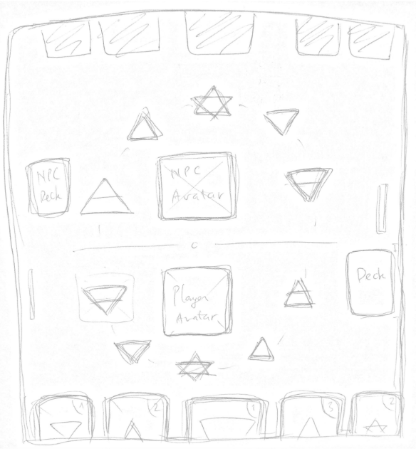
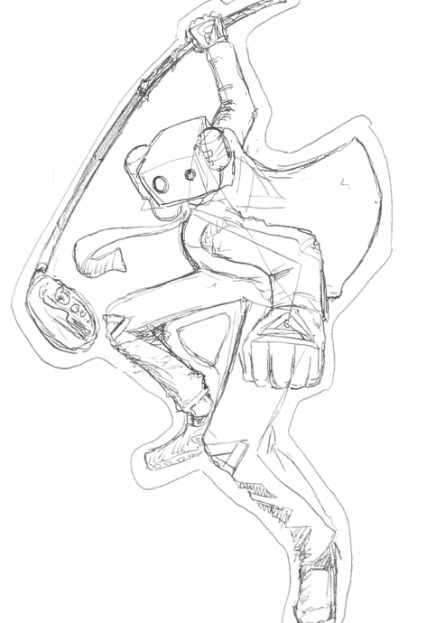
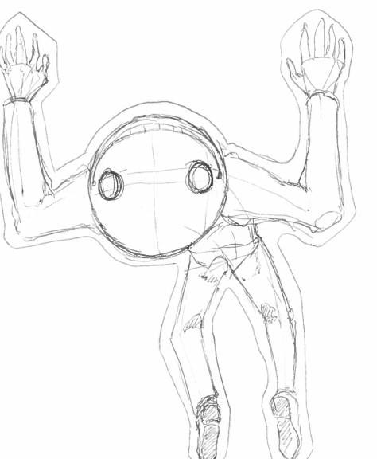

# leau.web.meta

## I. High concept

It's Poker mixed with Gwent, with only power-up cards for hero.

## II. Genre

"Push your luck" card game

## III. Platform

Desktop web

## IV. Story

The main purpose of this game is to be used as a supporting material for L'eau, my senior project. It does not have a story, but the artworks and contents will reflect the L'eau universe.

## V. Aesthetics

Graphic: Abstract Ink Sketch, Line heavy for each card.

Music: Ambient funk

Sound Effect: Card drawing, card dealing, and card revealing.

## VI. Gameplay

### Mechanics

Player first choose their initial hero avatar. Each avatar has:
+ A visual drawing of a characters
+ An unique maximum amount of card in the deck
+ An unique probability to draw certain type of card.

With the avatar, player proceed to play with an NPC.

The game has 3 rounds, each round has 2 phases: prepare and combat. In the prepare phase, each player take turn either drawing a card or using a card on their hand. The card will not be revealed to the other player. In the combat phase, players reveal their cards. Whoever has the stronger avatar win the round. Used cards are discarded, and the next round repeat the same process. Winner of 2 rounds win the game.

There are 5 types of attacking cards, each represented by an alchemy element:

+ Fire
+ Water
+ Wind
+ Earth
+ Ether

Certain types of card nullifies one another during the combat phase: Ether nullifies itself and anything with the most amount, Water nullifies Fire, Fire nullifies Wind, Wind nullifies Earth, Earth nullifies Water.

Water "nullifies" fire means, if Alice has 3 water and Bob has 4 fire, Bob's water points will be reduced by Alice's fire point. After nullify, Alice will still have 3 water however Bob will have only 1 fire. If Bob has less than 3 fire, he will lose all of it.

Ether nullification will be applied first, and it will nullify ether before nullify the type with the most amount.

After nullifying, the remaining element points are used to determine the strength of the avatar, except Ether.

For example:
+ A has 2 Fire, 4 Water, 1 Wind, 5 Ether
+ B has 5 Water, 6 Earth, 3 Ether

After ether nullifying ether, they each will have:
+ A has 2 Fire, 4 Water, 1 Wind, 2 Ether
+ B has 5 Water, 6 Earth

After ether nullifying the most amount, they each will have:
+ A has 2 Fire, 4 Water, 1 Wind
+ B has 5 Water, 4 Earth

After normal nullifying:
+ A has 4 Water, 1 Wind
+ B has 5 Water, 3 Earth

The winner is determined by the sum of all remaining elements. In this case, B won with 8 points.

### Control

Mouse to interact with the menu UI, the cards and the deck.

### Onboarding

On the player's very first round, they will be handhold on all available action in the game via overlay messages.

### Player learning

The player need mainly luck to win the game.

### Screenshots

### About the developer(s)

lab, gdd, interested in <a href="http://bfy.tw/DjIj">machine learning</a>, <a href="http://bfy.tw/DjIq">lifespan extension</a>, and <a href="http://bfy.tw/DjIr">decentralization</a>
